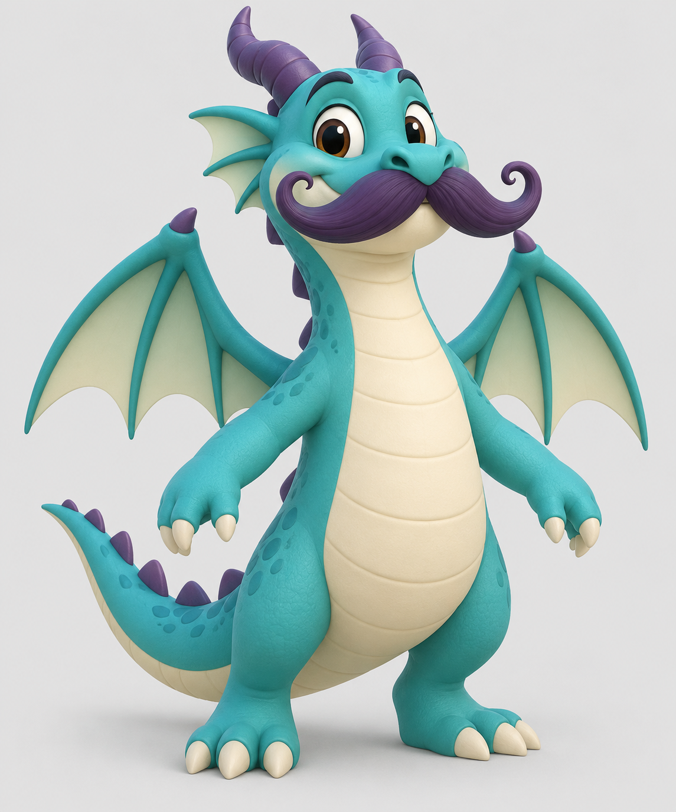
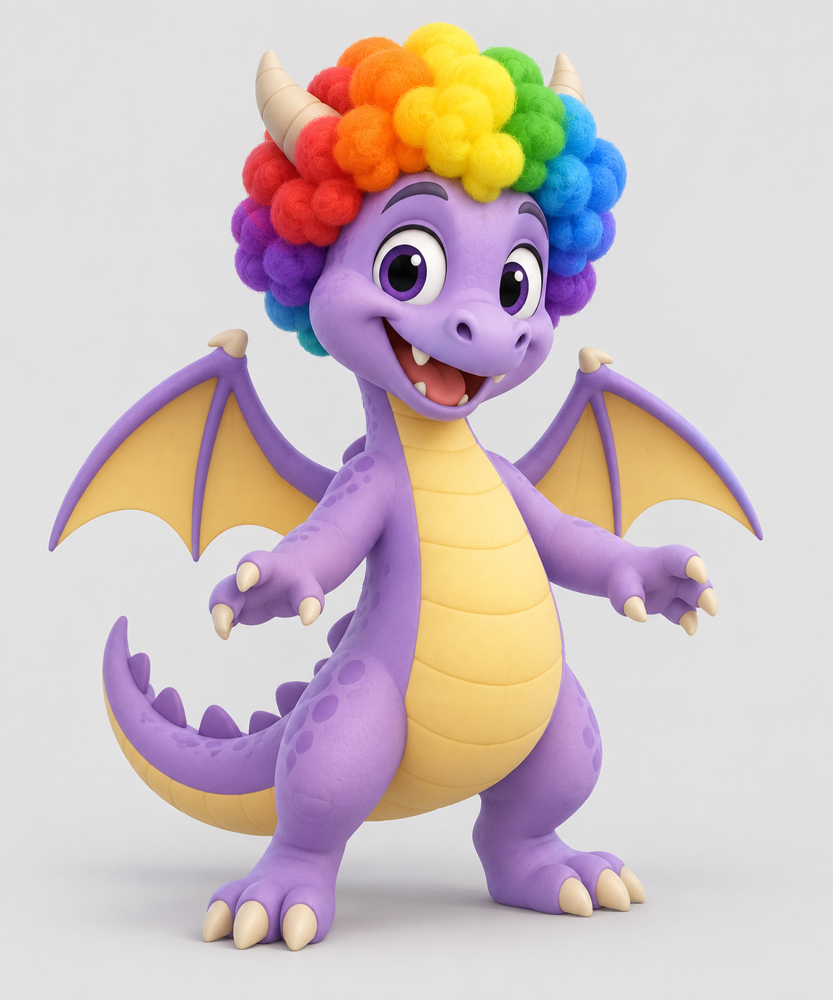
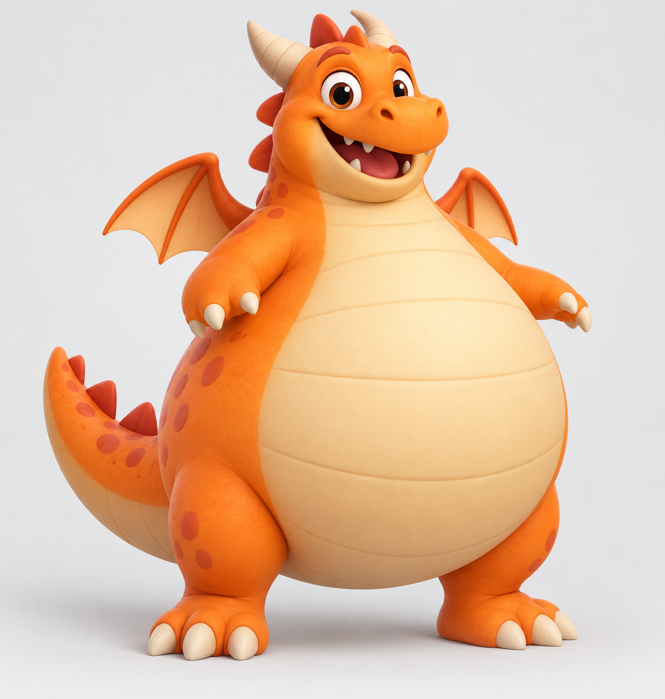
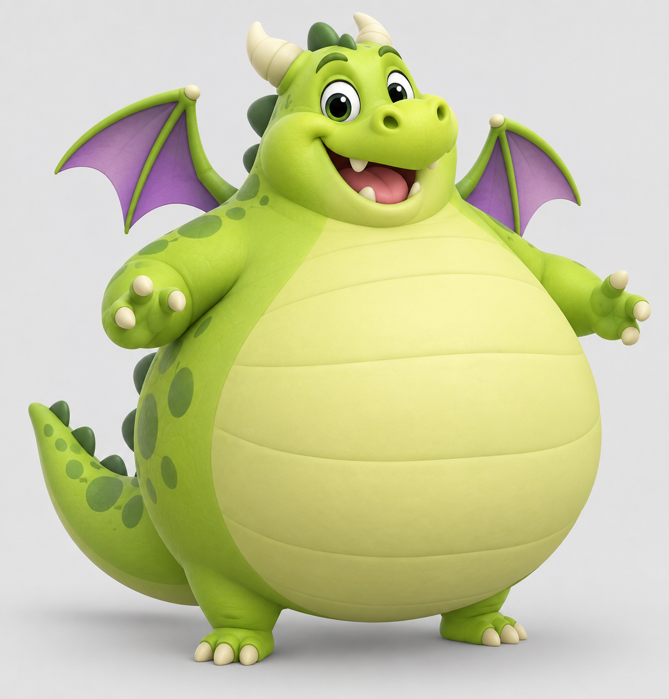
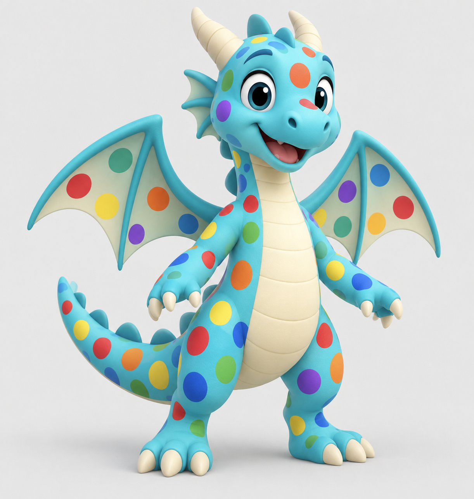
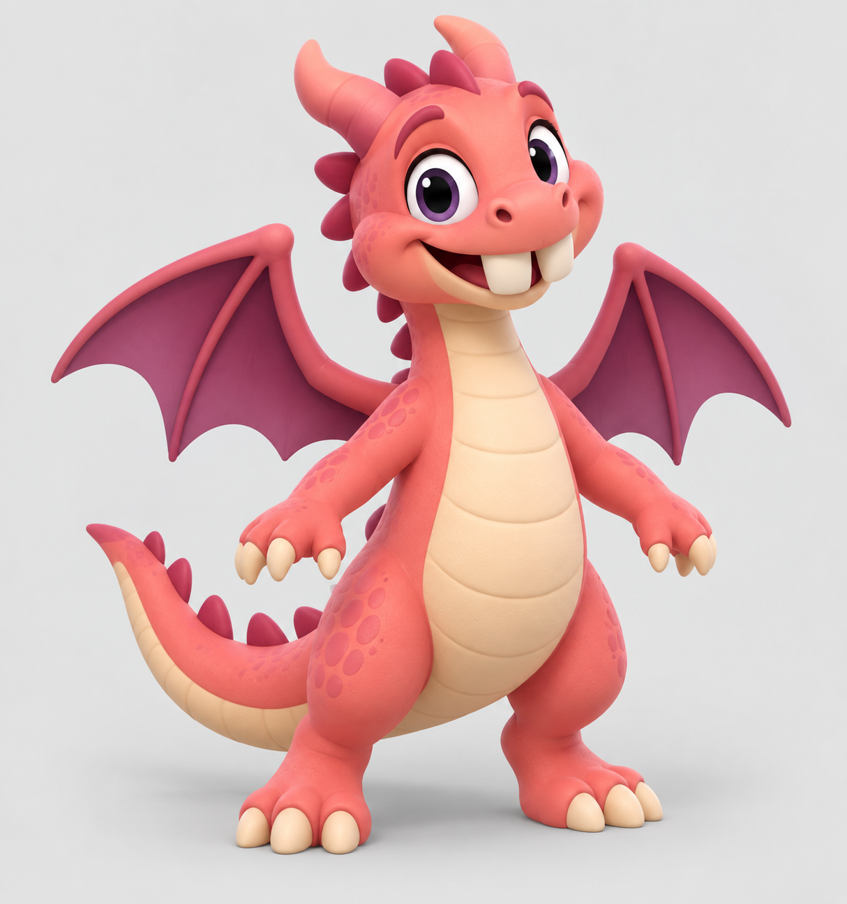
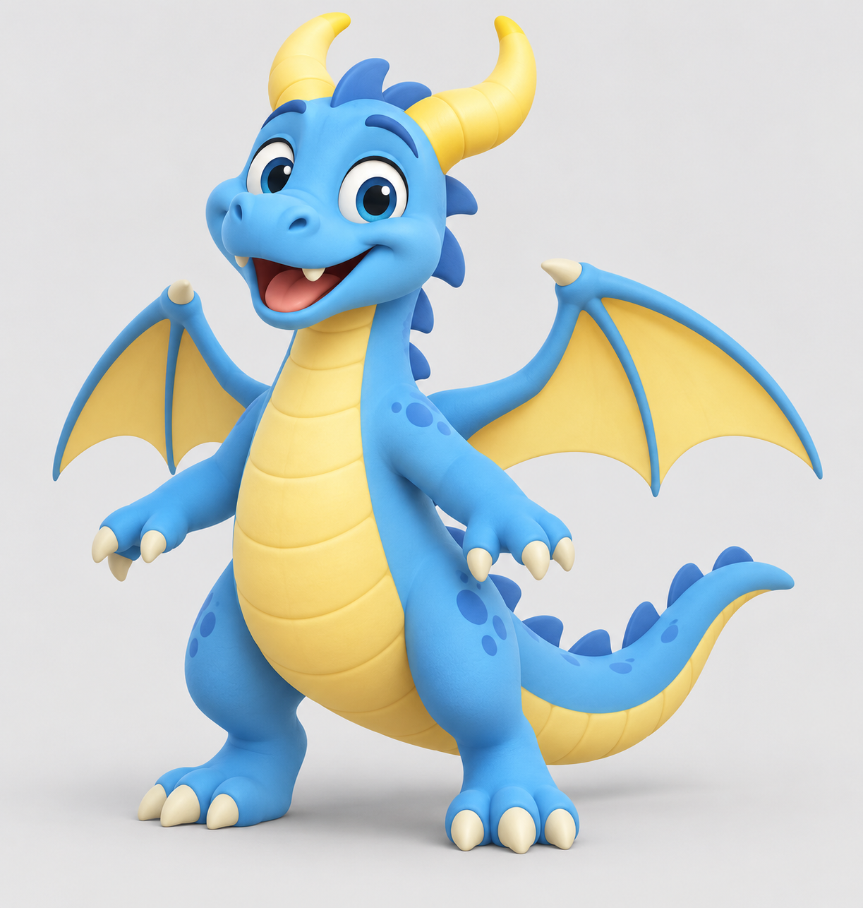
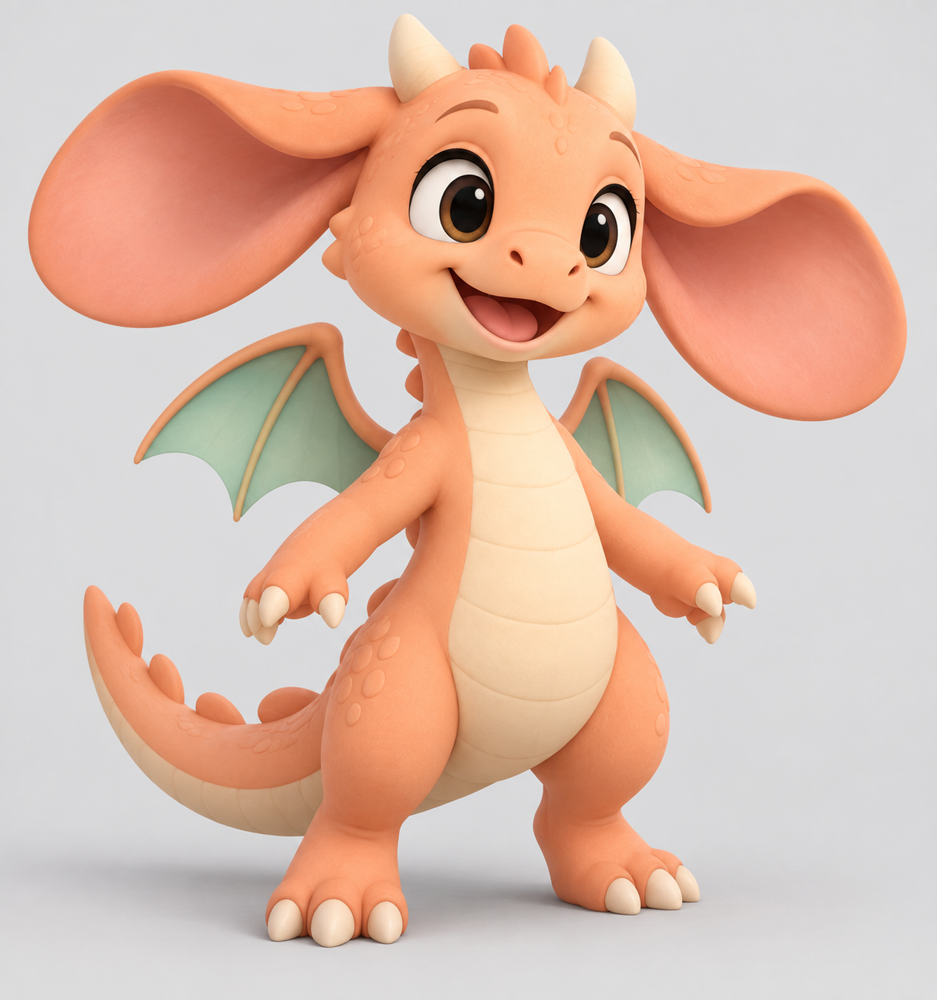
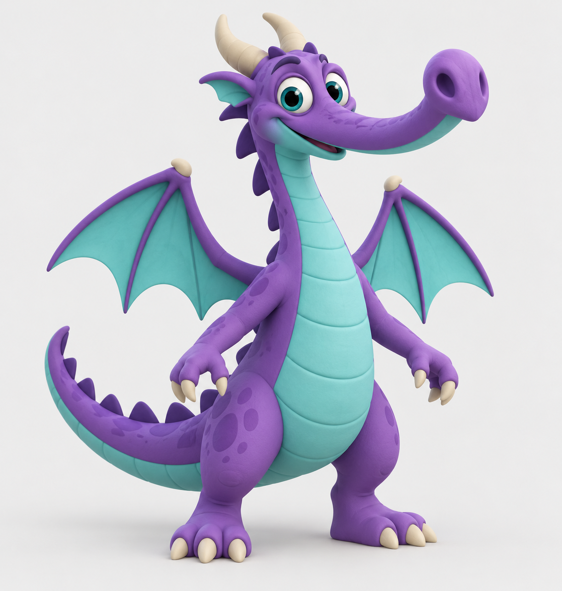
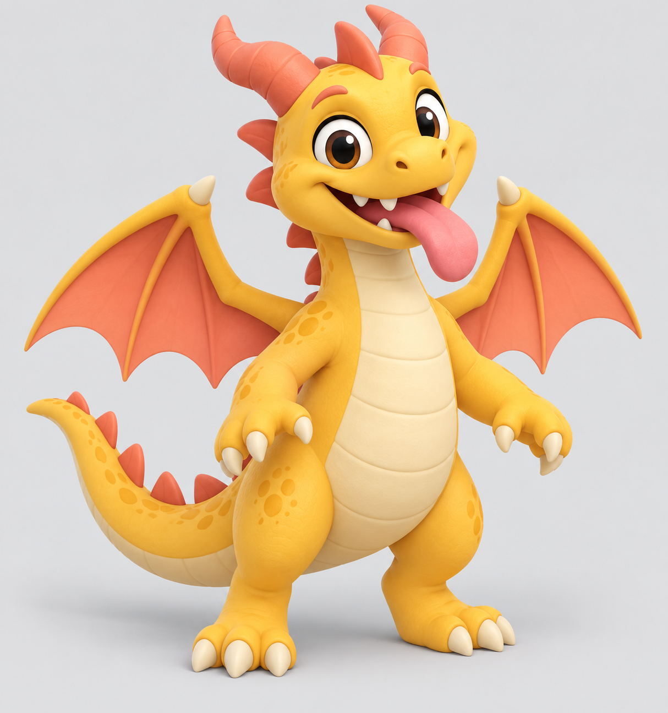

# Dragon reference gallery

Ten individual concept references generated with the built-in image-generation tool. Working names; Sophia chooses the final cast. These are not yet 3D models.

## 1. Sir Snortstache

Sophia's requested concept.

## 2. Professor Wiggles

Sophia's requested concept.

## 3. Lord Wobble

Sophia's requested concept.

## 4. Tiny Toes

Sophia's requested concept.

## 5. Confetti

Sophia's requested concept.

## 6. Nibble

Proposed extra concept.

## 7. Banana Bob

Proposed extra concept.

## 8. Flapjack

Proposed extra concept.

## 9. Sir Snoot

Proposed extra concept.

## 10. Blep

Proposed extra concept.

